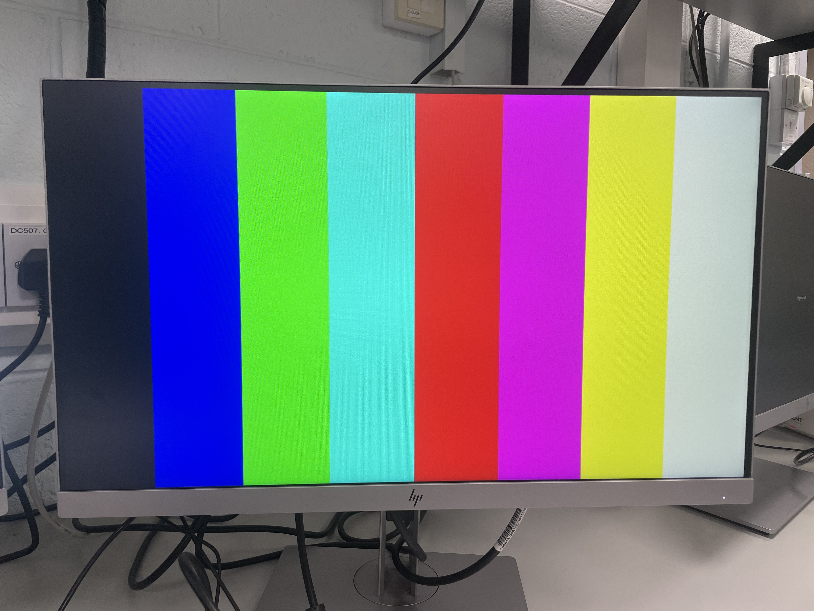

Welcome to my FPGA VGA Driver Project, where I bring classic Pac-Man characters to life using pure hardware logic. Explore how an FPGA generates real-time VGA graphics from scratch! 
## **Template VGA Design**
### **Project Set-Up**
Summarise the project set-up and design flow. Include a screenshot of your own set-up, for example see the image of my Project Summary window below. Guideline 1 short paragraph.
DO!!!

### **Template Code**
The template Verilog modules provided - ColourCycle and ColourStripes - introduce the basic structure for generating RGB signals on an FPGA using VGA timing. Both templates are designed to work alongside a VGA controller that outputs the current pixel's row and column coordinates, as well as the horizontal and vertical sync pulses. VGA works by scanning each pixel of the screen one row at a time, so your Verilog design must produce a correct RGB value for every (row, col) position during the active video period. 

The ColourStripes module uses simple combinational logic to assign different RGB values depending on the horizontal pixel position. By dividing the screen into eight vertical regions, it displays solid coloured stripes. This teaches coordinate-based pixel generation and demonstrates how the VGA controller "paints" the image left to right, top to bottom. 

The ColourCycle module instead uses a finite state machine (FSM) that cycles through eight preset colours. A counter determines how long each colour remains on screen before the state transitions. This illustrates sequential logic, state-based colour control, and the use of timing counters - all key skills needed before implementing complex designs such as Pac-Man and the ghosts. 

### **Simulation**
Simulation is used to verify that the VGA modules behave correctly before programming the FPGA. By running a testbench that drives the clock, reset, and (for the stripes module) row/col coordinates, you can observe the RGB outputs and confirm the logic changes at the correct times. The Vivado Simulator allows you to inspect state transitions, counters, and colour outputs in detail. 

This step makes it easy to catch logic errors early - for example, incorrect colour ranges or FSM transitions. Once the simulated output matches the expected behaviour (e.g., correct colour sequencing or stripe boundaries), the design is ready for synthesis.

Insert waveform simulation in class. 

### **Synthesis**
Synthesis converts your Verilog code into FPGA hardware logic, mapping it into LUTs, registers, block RAM, and routing resources. The Vivado tool produces a synthesis report that shows resource usage and identifies any timing issues. After synthesis, the implementation step places and routes the logic onto the FPGA fabric and generates the bitstream used to program the board.

Examining the synthesis/implementation reports ensures the design meets timing at the VGA pixel clock frequency (typically 25.175 MHz for 640x480 at 60Hz). This confirms your design can reliably generate video signals in real time. 

Insert synthesis summary.

### **Demonstration**
The final design was loaded onto the FPGA and successfully displayed the generated graphics on a VGA monitor. Below are photographs of the working demos showing the output on screen.

## **My VGA Design Edit**
Introduce your own design idea. Consider how complex/achievabble this might be or otherwise. Reference any research you do online (use hyperlinks).
### **Code Adaptation**
Briefly show how you changed the template code to display a different image. Demonstrate your understanding. Guideline: 1-2 short paragraphs.
### **Simulation**
Show how you simulated your own design. Are there any things to note? Demonstrate your understanding. Add a screenshot. Guideline: 1-2 short paragraphs.
### **Synthesis**
Describe the synthesis & implementation outputs for your design, are there any differences to that of the original design? Guideline 1-2 short paragraphs.
### **Demonstration**
If you get your own design working on the Basys3 board, take a picture! Guideline: 1-2 sentences.

## **More Markdown Basics**
This is a paragraph. Add an empty line to start a new paragraph.

Font can be emphasised as *Italic* or **Bold**.

Code can be highlighted by using `backticks`.

Hyperlinks look like this: [GitHub Help](https://help.github.com/).

A bullet list can be rendered as follows:
- vectors
- algorithms
- iterators

Images can be added by uploading them to the repository in a /docs/assets/images folder, and then rendering using HTML via githubusercontent.com as shown in the example below.

