Welcome to my FPGA VGA Driver Project, where I bring classic Pac-Man characters to life using pure hardware logic. Explore how an FPGA generates real-time VGA graphics from scratch! 
## **Template VGA Design**
### **Project Set-Up**
For this project, I used the provided VGA template design as a starting point and adapted it to create my own custom Pac-Man visual. My workflow followed a typical FPGA design flow: creating a new Vivado project, adding the template Verilog files, configuring the VGA timing parameters, and then writing my own colour-generation logic to replace the original stripe output. I synthesised, implemented, and simulated the design within Vivado before finally programming the FPGA board to view the output on a VGA monitor. This setup allowed me to test each stage - timing, logic behaviour, and final display - all within a structured hardware-design environment. 

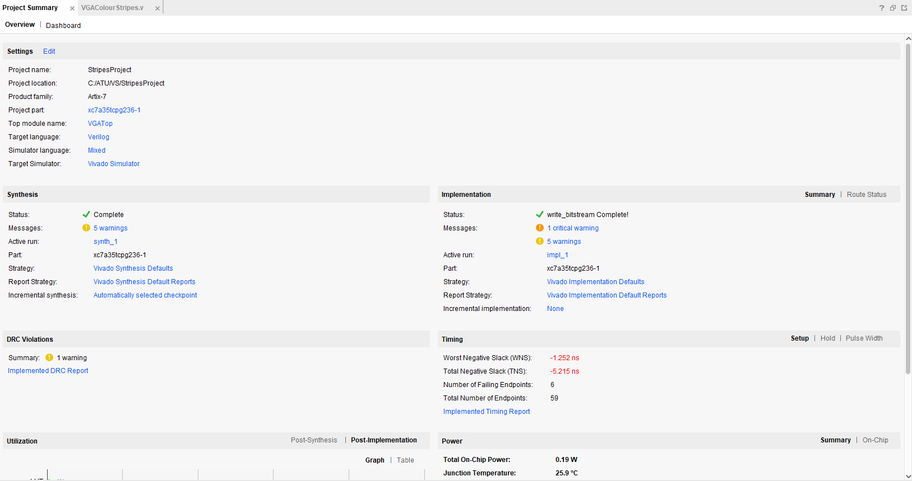

### **Template Code**
The template Verilog modules provided by my lecturer - ColourCycle and ColourStripes - introduce the basic structure for generating RGB signals on an FPGA using VGA timing. Both templates are designed to work alongside a VGA controller that outputs the current pixel's row and column coordinates, as well as the horizontal and vertical sync pulses. VGA works by scanning each pixel of the screen one row at a time, so the Verilog design must produce a correct RGB value for every (row, col) position during the active video period. 

The ColourStripes module uses simple combinational logic to assign different RGB values depending on the horizontal pixel position. By dividing the screen into eight vertical regions, it displays solid coloured stripes. This teaches coordinate-based pixel generation and demonstrates how the VGA controller "paints" the image left to right, top to bottom. 

The ColourCycle module instead uses a finite state machine (FSM) that cycles through eight preset colours. A counter determines how long each colour remains on screen before the state transitions. This illustrates sequential logic, state-based colour control, and the use of timing counters. 

### **Simulation**
Simulation is used to verify that the VGA modules behave correctly before programming the FPGA. By running a testbench that drives the clock, reset, and (for the stripes module) row/col coordinates, you can observe the RGB outputs and confirm the logic changes at the correct times. The Vivado Simulator allows you to inspect state transitions, counters, and colour outputs in detail. 

This step makes it easy to catch logic errors early - for example, incorrect colour ranges or FSM transitions. Once the simulated output matches the expected behaviour (e.g., correct colour sequencing or stripe boundaries), the design is ready for synthesis.

### **Synthesis**
Synthesis converts the Verilog code into FPGA hardware logic, mapping it into LUTs, registers, block RAM, and routing resources. The Vivado tool produces a synthesis report that shows resource usage and identifies any timing issues. After synthesis, the implementation step places and routes the logic onto the FPGA and generates the bitstream used to program the board.

Examining the synthesis/implementation reports ensures the design meets timing at the VGA pixel clock frequency (typically 25.175 MHz for 640x480 at 60Hz). This confirms the design can reliably generate video signals in real time. 

### **Demonstration**
The final design was loaded onto the FPGA and successfully displayed the generated graphics on a VGA monitor. Before reaching this stage, I also spent time experimenting with the code - adjusting parameters, testing different coordinate ranges, and modifying colour values - to deepen my understanding of how each part of the VGA pipeline affected the output. Below are photographs of the working demos showing the final visuals on screen.

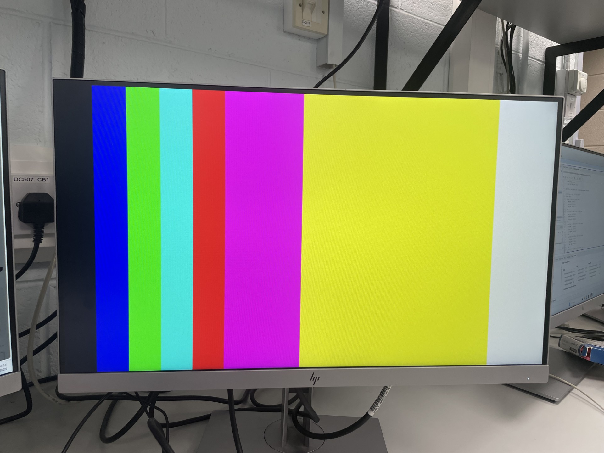
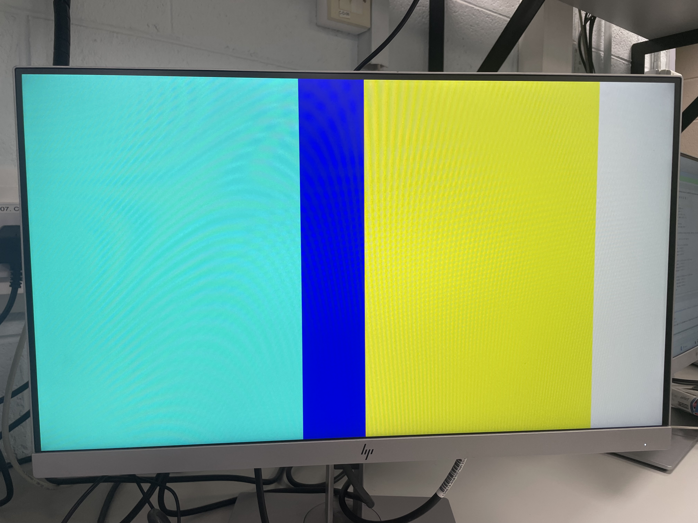

## **My VGA Design Edit**
I decided to create a simple Pac-Man-style visual for my FPGA VGA Driver project. Going into this, I assumed it would be relatively straightforward to configure the VGA logic and draw a few basic shapes on screen - but I quickly discovered that even simple graphics can become challenging when built at the hardware-description level.

To build confidence, I first created a few small practice visuals, including the French and Jamaican flags, as shown below. These early tests helped me establish a foundation in drawing pixel regions, using row/column counters, and controlling RGB signals. Once I felt comfortable with this workflow, I moved on to developing my actual Pac-Man design. 

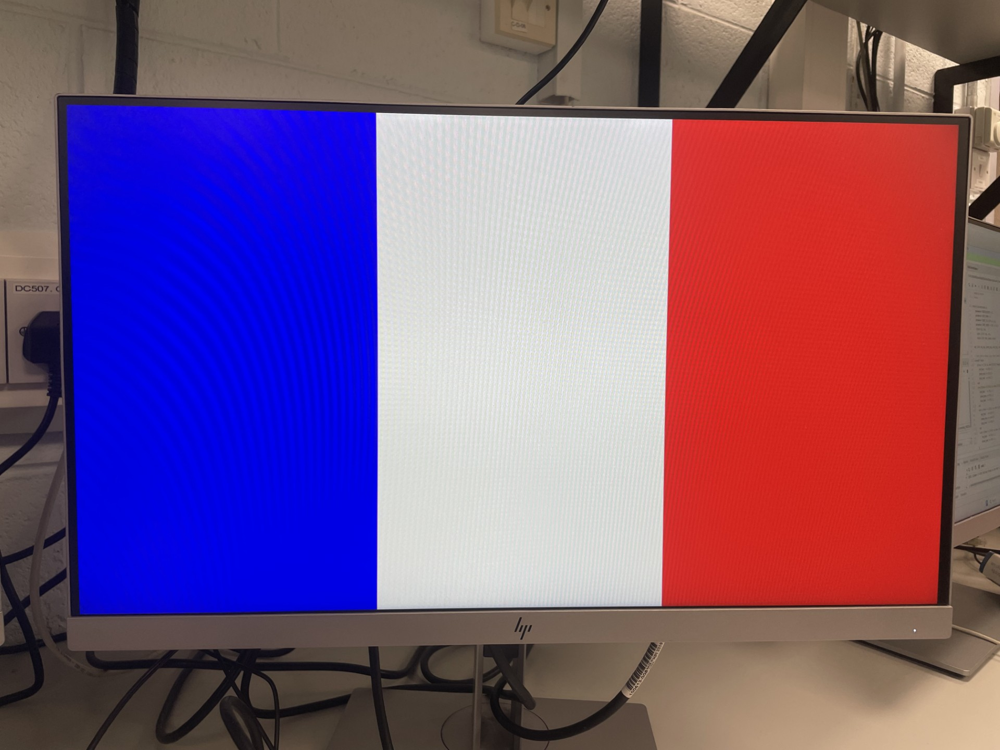
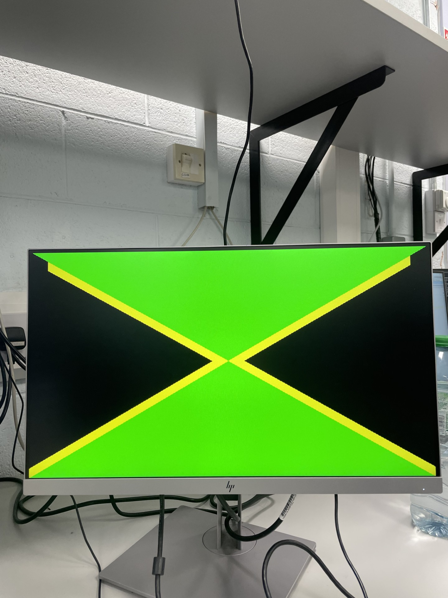

My final design consists of four main components:
  - A yellow Pac-Man character
  - Three ghosts (red, white, and cyan)
  - A blue maze-like grid structure
  - Beige pac-dots scattered throughout the maze

I decided to build each part in stages, beginning with Pac-Man on a blank screen to confirm that my coordinate system and circle-drawing logic were correct. Next, I added two ghosts to verify spatial alignment and ensure that the characters appeared consistently across frames. Once I introduced the maze structure, the complexity increased significantly - particularly with object alignment and priority ordering, since Pac-Man must always appear on top of the background elements. 

Despite the unexpected challenges, working through these problems gave me a much deeper understanding of VGA timing, pixel-based rendering, and hardware-driven graphics. The iterative process of refining each component ultimately shaped the final version of my project. Below are some of the early visuals I produced as I experimented with drawing Pac-Man and refining the layout of my design. 

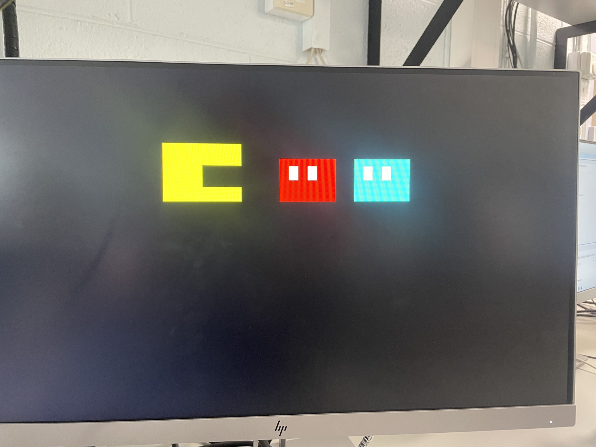
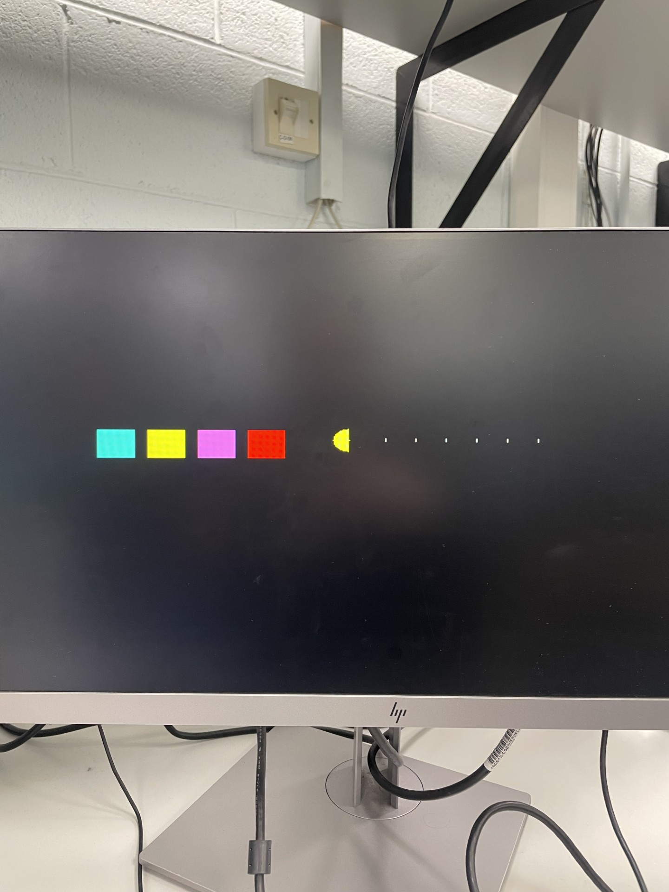

### **Code Adaptation**
I decided to use the Stripes template code as the foundation for my project, modifying it so that instead of solid colour bands, it would draw pixel-based shapes for my Pac-Man design. To do this, I reorganised the template into clearly defined sections and assigned priority levels to each graphic element. This allowed lower-priority objects (like the maze walls) to be drawn first, while higher-priority objects (such as Pac-Man and the ghosts) were drawn afterward so they would appear on top. 

The first modification I made was replacing the original stripe-generation logic with my own conditional checks for specific pixel regions. I began with the lowest-priority component - the maze grid - and created it by defining rectangular regions line by line using row and column comparisons. Once the walls rendered correctly, I added additional sections for the pac-dots, ghosts, and finally Pac-Man. This step-by-step restructuring demonstrated how the original template could be adapted from simple coloured stripes into a layered, fully customised VGA image. 

As I developed each part of my design, I found myself gradually building more confidence with how VGA timing and pixel drawing actually work. The ghosts, for example, are made from a combination of small rectangles: one block for the body and smaller ones for the eyes and pupils, each controlled by their own pixel-range conditions. Pac-man is a circular region with a triangualr section removed from the mouth, which pushed me to experiment with different mathematical expressions and shape cut-outs. Although the code looks long, the logic behind it is surprisingly intuitive - it felt almost like assembling a picture piece by piece, with each new if statement adding another element to the final design. 

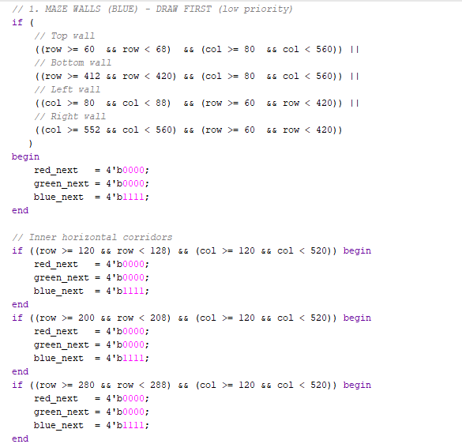
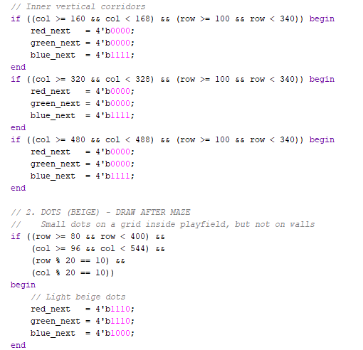
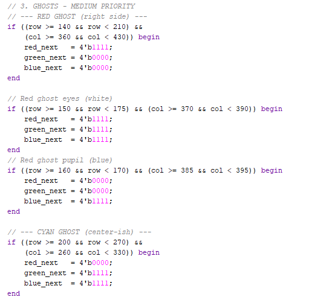
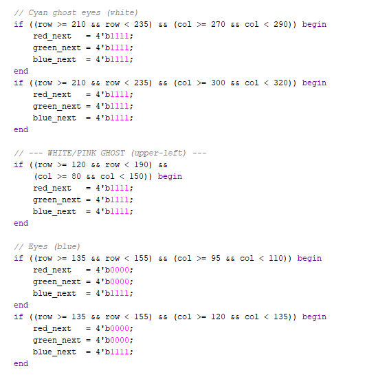
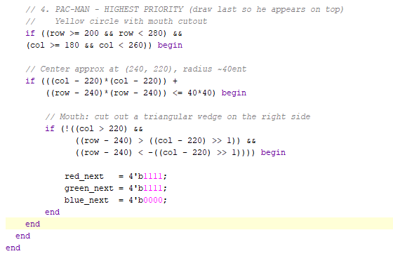

### **Simulation**
To test my VGA design, I simulated the project using Vivado's built-in simulator, which allowed me to examine how the timing signals and RBG outputs behaved over time. In the waveform, key signals such as clk, hsync, vsync, and the row/col counters can be seen updating as the pixel clock advances. Watching these counters increment and reset confirmed that the VGA timing generator was working correctly - particularly the transition through the active video region and the blanking intervals. I also monitored the red, green, and blue outputs to verify that colour values were being assigned only when the row and column matched the coordinate ranges of Pac-Man, the ghosts, or the maze walls. 

One important observation from simulation is that Vivado does not display the actual picture - instead, it shows signal changes. For example, in my screenshot, I can see the RGB values momentarily swicthing to non-zero values whenever the counters pass through areas where my code draws a specific object. This helped me confirm that my priority logic was correct and that higher-priority objects (like Pac-Man) were drawn after background elements. By reviewing these transitions, I was able to catch small alignment and timing issues before synthesising the design onto hardware. 

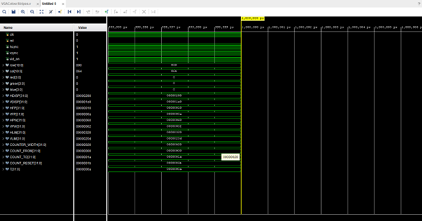

### **Synthesis**
After synthesising and implementing my modified VGA design in Vivado, the reports showed that the additional Pac-Man drawing logic increased the amount of combinational logic compared to the original Stripes template. Most of the extra utilisation came from the numerous row/column comparisons used to draw the characters and maze. 

Unlike the original template, my version did not fully meet timing. Vivado reported timing violations on paths inside the colour and shape-generation logic, where several nested if conditions are evaluated within a single clock cycle. This means that although the design still fits comfortably in terms of area, the extra complexity makes it harder to run reliably at the required pixel clock frequency. In practice the design still worked on hardware, but the timing report highlights that the modified version is more demanding than the simple stripe generator and would benefit from optimisation (for example, simplifying conditions or pipelining parts of the logic). 

### **Demonstration**
While my final design may not have been perfect, it successfully produced a Pac-Man themed display on the VGA monitor. I was able to see Pac-Man, the ghosts, pac-dots, and maze all rendered from my Verilog logic, which was rewarding after working through alignment and timing issues. Even with some minor visual imperfections, the project demonstrated that my VGA timing and pixel-drawing design worked as intended and helped me understand FPGA graphics much more clearly. 

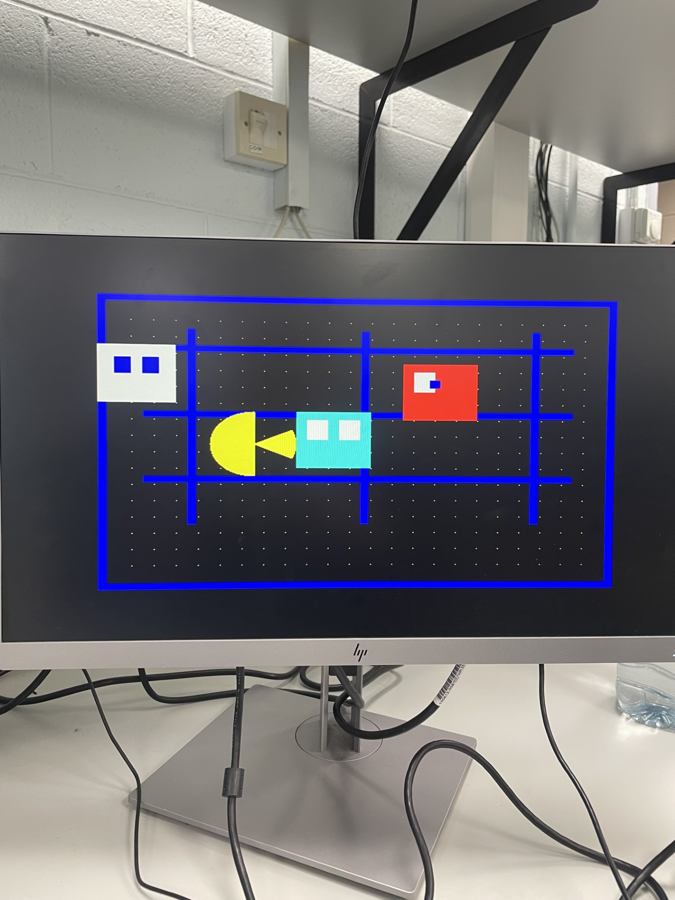

### **References**
[1] Project F, “FPGA Graphics: VGA,” Project F, 2022. [Online]. Available: [https://projectf.io/posts/fpga-graphics/]

[2] M. Lynch, “FPGA VGA Driver Template,” lecture notes and source code provided for SoC module, Department of Engineering, [ATU Galway], 2025.

[3] V. H. Adams, "VGA Driver in Verilog," VanhunterAdams.com. [Online]. Available: [https://vanhunteradams.com/DE1/VGA_Driver/Driver.html]

[4] "VGA on-FPGAs - VGA Driver and Verilog Examples," FPGA4Fun.com. [Online}. Available: [https://www.fpga4fun.com/VGA.html]
